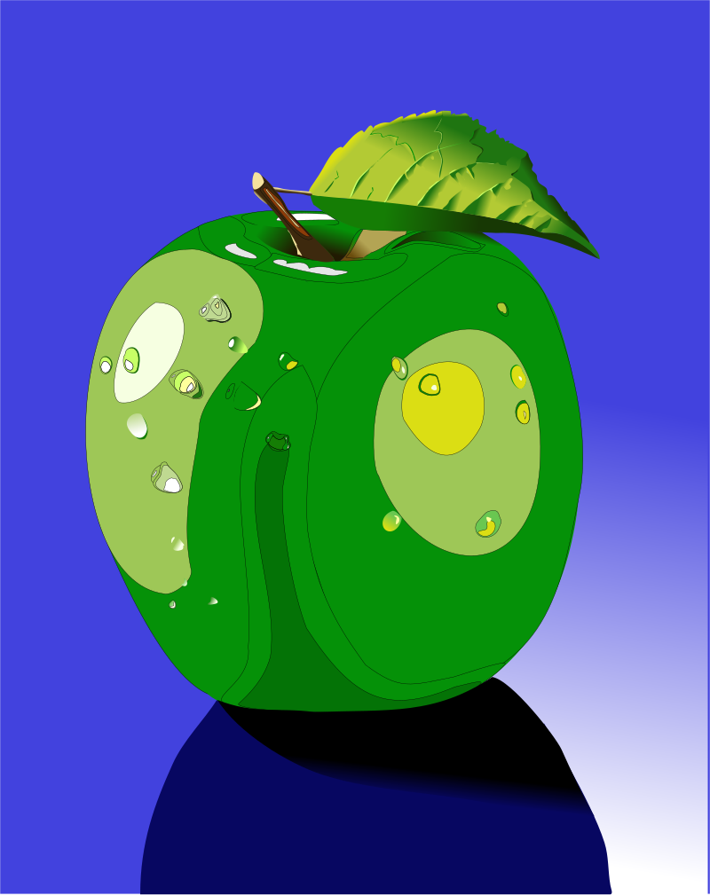

# riscos-artworks-js

A JavaScript library with file format [documentation](docs/README.md) for Computer Concepts era 
RISC OS [ArtWorks][artworks-wikipedia] files.

## About

riscos-artworks-js is a JavaScript library for reading and writing ArtWorks files.

The project was started in the aim of preserving the content of these files.

A work-in-progress online viewer is hosted [here](http://richardbrown384.github.io/riscos-artworks-react).



## Installation

```bash
npm install git+https://github.com/RichardBrown384/riscos-artworks-js.git
```

## Usage

To use in code

```javascript
const {Artworks} = require('riscos-artworks');

const artworks = Artworks.fromUint8Array(array);
const array = Artworks.toUint8Array(artworks);
```

The library has some scripts that can be used to aid with the deciphering process

### unpack and pack

To unpack the contents of an ArtWorks file into a JSON structure you can use the following command

```bash
npm run unpack source,d94 target.json
```

To pack a JSON structure into an ArtWorks file you can use

```bash
npm run pack source.json target,d94
```

### trawl

To recursively trawl a directory of ArtWorks files and have a summary of any problems you can use

```bash
npm run trawl directory
```

### stats

The stats script can be used in conjunction with the [trawl](#trawl) script to analyse records.
Modify the read process to log any data you're interested in, such as record bodies, as a line of JSON.
This script will then work out how many values appear in a given field for that set of records.

```bash
npm run stats json-per-line
```

### examples

To generate example ArtWorks files held in examples directory to a destination of your choice use

```bash
npm run examples target_directory
```

## Project status

Large parts of the file format aren't well understood. Therefore, the library and documentation are offered
as works in progress and there isn't much emphasis on the software engineering fundamentals
such as testing.

Writing ArtWorks files is experimental and only a limited subset of features is supported. Typically, only
those features that are well understood are supported, such as fills and strokes.

---
[artworks-wikipedia]: https://en.wikipedia.org/wiki/ArtWorks
