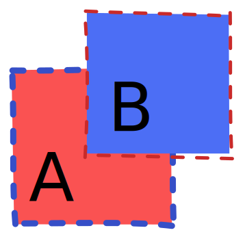
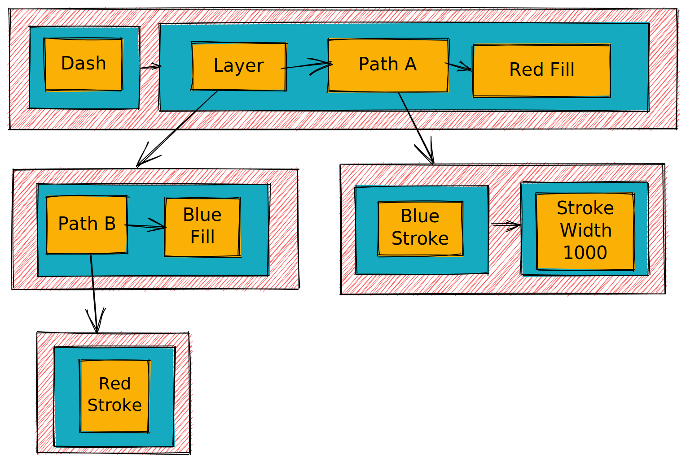
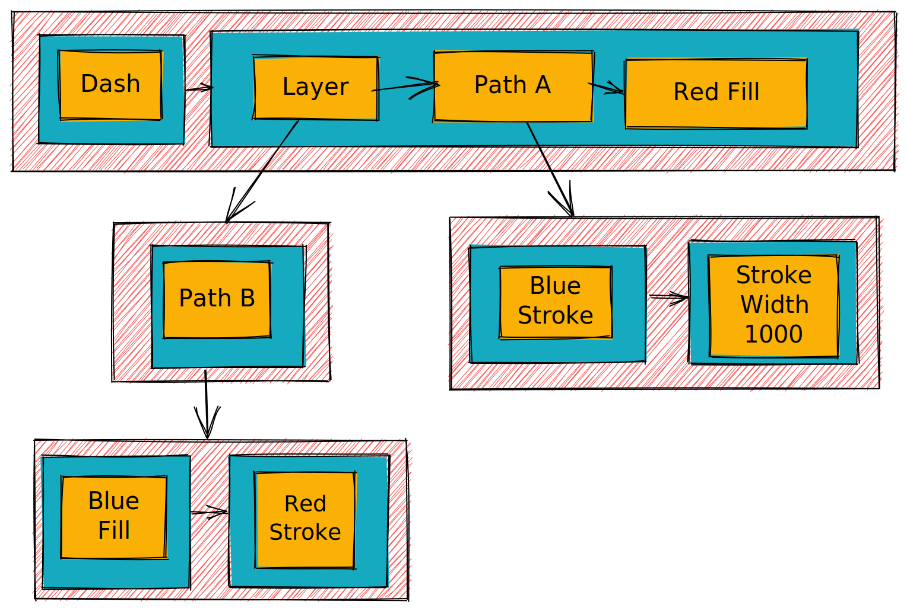
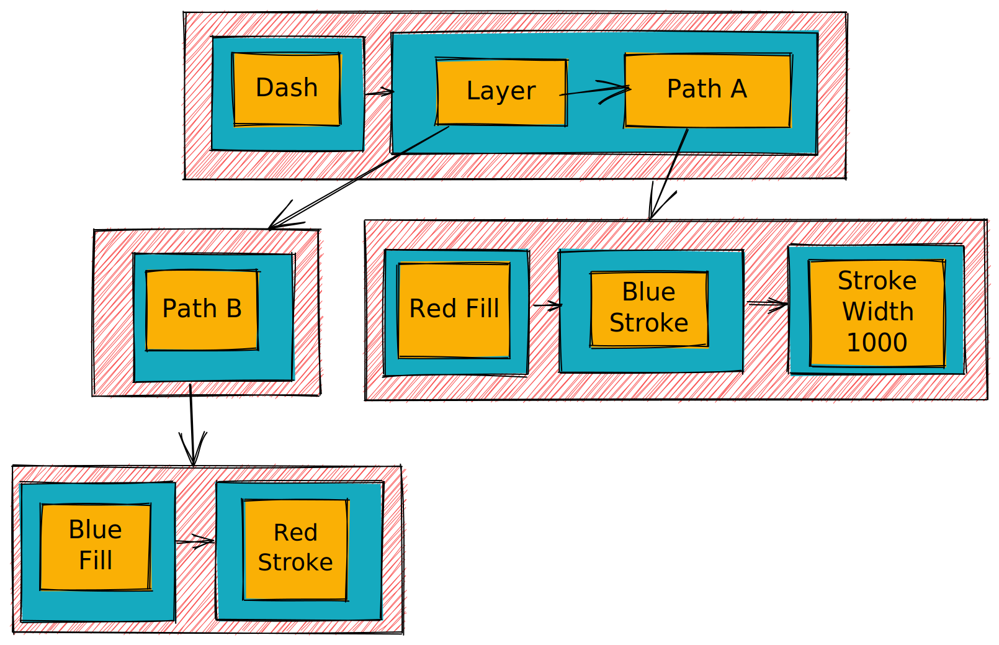
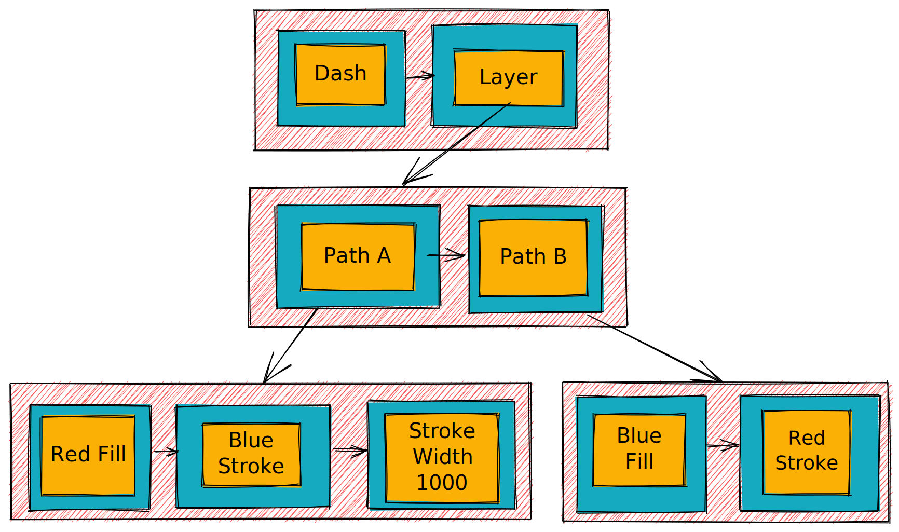

# RISC OS ArtWorks File Format

## Table of contents

* [About](#about)
* [General observations](#general-observations)
* [Header](#header)
* [Body](#body)
    * [Body structure](#body-structure)
        * [Lists](#lists)
        * [List](#list)
        * [SubLists](#sublists)
        * [Traversal](#traversal)
    * [Record header](#record-header)
    * [Record types](#record-types)
        * [Type 0x00](#type-0x00-unknown)
        * [Type 0x01](#type-0x01-unknown-text)
        * [Type 0x02 - Path](#type-0x02-path)
        * [Type 0x05 - Sprite](#type-0x05-sprite)
        * [Type 0x06 - Group](#type-0x06-group)
        * [Type 0x0A - Layer](#type-0x0a-layer)
        * [Type 0x21 - Work Area](#type-0x21-work-area)
        * [Type 0x22](#type-0x22-unknown)
        * [Type 0x23 - File Save Location](#type-0x23-file-save-location)
        * [Type 0x24 - Stroke Colour](#type-0x24-stroke-colour)
        * [Type 0x25 - Stroke Width](#type-0x25-stroke-width)
        * [Type 0x26 - Fill](#type-0x26-fill)
        * [Type 0x27 - Join Style](#type-0x27-join-style)
        * [Type 0x28 - End Line Cap](#type-0x28-end-line-cap)
        * [Type 0x29 - Start Line Cap](#type-0x29-start-line-cap)
        * [Type 0x2A - Winding Rule](#type-0x2a-winding-rule)
        * [Type 0x2B - Dash Pattern](#type-0x2b-dash-pattern)
        * [Type 0x2C - Rectangle](#type-0x2c-rectangle)
        * [Type 0x2D](#type-0x2d-character)
        * [Type 0x2E](#type-0x2e-unknown)
        * [Type 0x2F](#type-0x2f-font-name)
        * [Type 0x30](#type-0x30-font-size)
        * [Type 0x31](#type-0x31-unknown)
        * [Type 0x32](#type-0x32-unknown)
        * [Type 0x33](#type-0x33-unknown)
        * [Type 0x34 - Ellipse](#type-0x34-ellipse)
        * [Type 0x35 - Rounded Rectangle](#type-0x35-rounded-rectangle)
        * [Type 0x37 - Distortion Group](#type-0x37-distortion-group)
        * [Type 0x38 - Perspective Group](#type-0x38-perspective-group)
        * [Type 0x39](#type-0x39-file-information)
        * [Type 0x3A - Blend Group](#type-0x3a-blend-group)
        * [Type 0x3B - Blend Options](#type-0x3b-blend-options)
        * [Type 0x3D - Blend Path](#type-0x3d-blend-path)
        * [Type 0x3E - Start Marker](#type-0x3e-line-start-marker)
        * [Type 0x3F - End Marker](#type-0x3f-line-end-marker)
        * [Type 0x42 - Distortion Subgroup](#type-0x42-distortion-subgroup)
    * [Coordinate system](#coordinate-system)
    * [Path data](#path-data)
    * [Palette](#palette)
    * [Colour indices](#colour-indices)
    * [Sprite area](#sprite-area)
    * [UBuf](#ubuf)
* [Rendering](#rendering)
* [References](#references)

## About

This document represents the outcome of an imperfect attempt to decipher the data stored in ArtWorks files and will
therefore contain errors and omissions.

The initial deciphering process involved manipulating ArtWorks files with a hex editor and opening them in !AWViewer.
There are therefore two consequences.
Firstly, features not present in the available files (those found on ArtWorks ClipArt CD1) are not documented here.
Secondly, in the absence of a feature list, it is hard to interpret the binary words that might represent
features or options.

Since being able to write ArtWorks files, the process has included programmatically creating small handcrafted files
to either confirm existing statements or to infer the purpose of certain record types in a controlled environment.

## General observations

There a general number of observations that can be made about the files

1. Because of the early ARM heritage the data is little endian and word aligned.
2. The files are record based, and some record type numbers seem to coincide with their !Draw equivalents.
3. The records are stored in a tree/graph structure.
4. The vector data format is virtually identical to !Draw's.
5. The visual representation (stroke, cap) information are stored separately from the vectors.
6. Colours are usually referenced by an index into a palette of defined colours.
7. Unlike !Draw, fonts appear to be referenced by name throughout.
8. Strings are null terminated. However, there's often what looks like garbage after the string
   to pad it to a word boundary.

## Header

The header has a 16 byte signature followed by more data whose purpose is largely unknown.

| Offset | Length | Content                                                                     |
|--------|--------|-----------------------------------------------------------------------------|
| 0      | 4      | Top!                                                                        |
| 4      | 4      | Unknown (version?) 9, 10                                                    |
| 8      | 8      | TopDraw (null terminated)                                                   |
| 16     | 4      | Unknown, appears to be always 0                                             |
| 20     | 4      | Absolute offset to start of [Body](#body)                                   |
| 24     | 4      | European paper width in 640ths of a printer's point                         |
| 28     | 4      | European paper height in 640ths of a printer's point                        |
| 32     | 8      | Unknown                                                                     |
| 40     | 4      | Absolute offset to start of [Undo Buffer](#ubuf), -1 if absent              |
| 44     | 4      | Absolute offset to start of [Sprite Area][sprite-area-format], -1 if absent |
| 48     | 4      | Unknown                                                                     |
| 52     | 4      | US paper width in 640ths of a printer's point                               |
| 56     | 4      | US paper height in 640ths of a printer's point                              |
| 60     | 4      | Absolute offset to start of [Palette](#palette)                             |
| 64     | 28     | Unknown                                                                     |
| 92     | 36     | Unknown, appears to be reserved space, padded with 0                        |

Note of paper dimensions: The European sizes seem to often conform to [ISO-126][iso-216], but the
width and height values are sometimes flipped, presumably because of page orientation.

There is only one US paper size, that of the US letter (8.5 x 11.0 in), in all the files available.

## Body

The body comprises a list of lists of records. If one were to describe the format of the body in a typed
language like Java or C# then the body would look like

```java
class ArtWorks {
    private List<List<ArtWorksRecord>> body;
}
```

ArtWorksRecords, depending on the type of record, can themselves have their own list of lists of records.

````java
class ArtWorksRecord {
    private List<List<ArtWorksRecord>> subLists;
}
````

### Body structure

#### Lists

Starting at offset specified in the header there are a series of doubly-linked list nodes with the following structure

| Offset | Length | Content                 |
|--------|--------|-------------------------|
| 0      | 4      | Offset to previous list |
| 4      | 4      | Offset to next list     |
| 8      | varies | [List](#list) data      |

Note that both offsets are relative to the _start_ of the node.
An offset of zero means that there is no previous or next entry.

#### List

Lists are doubly-linked list nodes and have the following structure

| Offset | Length | Content                       |
|--------|--------|-------------------------------|
| 0      | 4      | Offset to next record         |
| 4      | 4      | Offset to previous record     |
| 8      | varies | [Record data](#record-header) |

As above, the offsets are relative to the _start_ of the child node.
An offset of zero means that there is no previous or next entry.

#### SubLists

Records can also have SubLists. When a record has SubLists, there will be an
extra 8 bytes at the end of the record containing a pointer to the start of the SubLists.

| Offset | Length | Content                     |
|--------|--------|-----------------------------|
| n - 8  | 4      | Offset to previous SubLists |
| n - 4  | 4      | Offset to next SubLists     |

The offsets are relative to `n-8`. An offset of zero means that there is no previous or next entry.

The rule appears to be that a record can have SubLists if and only if it isn't the last record in a List.

Evidence:

1. Layer records without SubLists typically appear inside singleton lists.
2. Path records in certain files have data after the vectors, and the viable pointers
   occupy the last 8 bytes of the record.
3. Attribute records, such as fills or stroke width, seem to reside as leaves
   in singleton lists.
4. Adopting this scheme appears to guarantee that the file is read without leaving
   a significant number of 8 byte gaps. These 8 byte gaps would indicate
   missed pointers at the end of records.

##### First previous pointers

It appears that SubLists need to know which record they are descended from.
To achieve this the first SubLists previous pointer will point back to the
location of the SubLists pointer at the end of the parent record.

It also appears that records need to know which record they are descended from.
For example a Stroke Width record needs to know which Path record it descended from.
To achieve this the first previous pointer in a List will point back to the
start of the parent record.

If a record isn't descended from another, then the previous pointer will be zero.

If these pointers aren't set correctly then !AWViewer won't draw anything.

#### Traversal

The files can be traversed as follows

```javascript
function readLists() {
    while (true) {
        const {position, next} = readListPointer();
        readList();
        if (next !== 0) {
            setPosition(position + next);
        } else {
            break;
        }
    }
}

function readList() {
    while (true) {
        const {position, next} = readRecordPointer();
        readRecord();
        if (next !== 0) {
            readSubLists(position + next - 8);
        } else {
            break;
        }
        setPosition(position + next);
    }
}

function readSubLists(subListPointerPosition) {
    const current = getPosition();
    assert(current <= subListPointerPosition);
    setPosition(subListPointerPosition);
    const {position, next} = readSubListsPointer();
    if (next !== 0) {
        setPosition(position + next);
        readLists();
    }
}
```

where

1. The `readListPointer`, `readRecordPointer` and `readSubListsPointer` functions read the appropriate `next`
   and `previous` values, and return them along with the position of the pointer in the file.
2. The `setPosition` function allows one to navigate to a certain point in the file.
3. The `readRecord` function reads the appropriate record data from the file.

### Record header

The records, unless noted otherwise, all share a common header.

| Offset | Length | Content                                             |
|--------|--------|-----------------------------------------------------|
| 0      | 4      | Record type (Bits 0-7 type, 8-31 are sometimes set) |
| 4      | 4      | [Header control word](#header-control-word)         |
| 8      | 4      | Bounding Box Min X                                  |
| 12     | 4      | Bounding Box Min Y                                  |
| 16     | 4      | Bounding Box Max X                                  |
| 20     | 4      | Bounding Box Max Y                                  |

The bounding box elements, given ArtWorks uses signed coordinates, may be negative.

For objects that have no immediate visual representation, such as the palette, the bounding box
entries are usually zero.

#### Header control word

The function of the header control word is not very well understood.

However, in simple cases, the following seems to apply.

| Bit(s) | Content                                                                  |
|--------|--------------------------------------------------------------------------|
| 0      | If set then style records (fills and so on) are used, otherwise ignored. |
| 1      | If set then path records are used, otherwise ignored.                    |
| 2..3   | Unknown                                                                  |
| 4      | Seems to be set if the path was computed for perspective or distortion.  |
| 5..7   | Unknown                                                                  |
| 8..15  | Unknown, perhaps a counter or index, some files have sequential values.  |
| 16..31 | Unknown                                                                  |

Note that, for paths, if bit 1 is clear the path itself is invisible, but its descendants
might not be.

### Record types

#### Type 0x00: Unknown

This record appears to be always 124 bytes long and filled with zeros.

| Offset | Length | Content                         |
|--------|--------|---------------------------------|
| 0      | 24     | [Record header](#record-header) |
| 24     | 100    | Unknown (0)                     |

#### Type 0x01: Unknown, Text

Notes: After the bounding rectangle there are a number of trailing zeros.
The number of zeros can vary, and there can sometimes be string data present at offset 84 too.

| Offset | Length | Content                            |
|--------|--------|------------------------------------|
| 0      | 24     | [Record header](#record-header)    |
| 24     | 4      | Unknown                            |
| 28     | 4      | Unknown                            |
| 32     | 4      | Unknown                            |
| 36     | 4      | Unknown                            |
| 40     | 4      | Unknown                            |
| 44     | 4      | Unknown                            |
| 48     | 4      | Bounding Rectangle Bottom Left X   |
| 52     | 4      | Bounding Rectangle Bottom Left Y   |
| 56     | 4      | Bounding Rectangle Top Left X      |
| 60     | 4      | Bounding Rectangle Top Left Y      |
| 64     | 4      | Bounding Rectangle Top Right X     |
| 68     | 4      | Bounding Rectangle Top Right Y     |
| 72     | 4      | Bounding Rectangle Bottom Right X  |
| 76     | 4      | Bounding Rectangle Bottom Right Y  |
| 80     | Varies | Unknown                            |
| n - 8  | 8      | [SubLists pointer](#sublists)      |

#### Type 0x02: Path

Note: In certain cases there's extra data after the path data.

| Offset | Length | Content                         |
|--------|--------|---------------------------------|
| 0      | 24     | [Record header](#record-header) |
| 24     | varies | [Path data](#path-data)         |
| varies | varies | Unknown, sometimes present      |
| n - 8  | 8      | [SubLists pointer](#sublists)   |

#### Type 0x05: Sprite

Sprites appear to be referenced by name into the [Sprite Area][sprite-area-format].

The unknown coordinates seem to agree with the bounding box.
There appears to be a transformation matrix defined after the coordinates in 16.16 format.
The palette defined in this record seems to take precedence over the one defined with the sprite.

| Offset | Length | Content                                                    |
|--------|--------|------------------------------------------------------------|
| 0      | 24     | [Record header](#record-header)                            |
| 24     | 4      | Unknown                                                    |
| 28     | 12     | Sprite name                                                |
| 40     | 4      | Unknown                                                    |
| 44     | 4      | Unknown                                                    |
| 48     | 4      | Unknown X-Coordinate 1                                     |
| 52     | 4      | Unknown Y-Coordinate 1                                     |
| 56     | 4      | Unknown X-Coordinate 2                                     |
| 60     | 4      | Unknown Y-Coordinate 2                                     |
| 64     | 4      | Unknown X-Coordinate 3                                     |
| 68     | 4      | Unknown Y-Coordinate 3                                     |
| 72     | 4      | Unknown Matrix Element (65536)                             |
| 76     | 4      | Unknown Matrix Element (0)                                 |
| 80     | 4      | Unknown Matrix Element (0)                                 |
| 84     | 4      | Unknown Matrix Element (65536)                             |
| 88     | 4      | Unknown Matrix Element (X translation?)                    |
| 92     | 4      | Unknown Matrix Element (Y translation?)                    |
| 96     | 4      | Unknown                                                    |
| 100    | 4      | Sprite Mode                                                |
| 104    | 4      | Number of sprite palette entries                           |
| 108    | varies | Sequential [sprite palette entries](#sprite-palette-entry) |

#### Sprite palette entry

| Offset | Length | Content                              |
|--------|--------|--------------------------------------|
| 0      | 4      | Colour (BGR) usually with bit 29 set |

#### Type 0x06: Group

Bit 1 of the [header control word](#header-control-word) must be set in order for the group to be drawn.

The bounding box must be valid and encompass the group objects in order for !AWViewer
to draw the group properly.

The function of the unknowns in the record body aren't understood. Various values were tried: 0, -1
0x55555555 and 0xAAAAAAAA to no noticeable affect.

| Offset | Length | Content                         |
|--------|--------|---------------------------------|
| 0      | 24     | [Record header](#record-header) |
| 24     | 4      | Unknown                         |
| 28     | 4      | Unknown                         |
| 32     | 4      | Unknown                         |
| 36     | 8      | [SubLists pointer](#sublists)   |

#### Type 0x0A: Layer

| Offset | Length | Content                                                                                      |
|--------|--------|----------------------------------------------------------------------------------------------|
| 0      | 24     | [Record header](#record-header)                                                              |
| 24     | 4      | Unknown. Bit 3 is usually set and both bits 3 and 0 must be set for the layer to be visible. |
| 28     | 32     | Layer name, null terminated. The length stated here is a guess.                              |
| 60     | 8      | [SubLists pointer](#sublists)                                                                |

#### Type 0x21: Work Area

This record is thought to always occur at the end of the file. The record will always contain
the file's [Palette](#palette) information, but may also contain other information such as the
[Undo Buffer](#ubuf). The object locations within this record are determined by absolute
offsets specified in the file's [header](#header).

| Offset | Length | Content                                      |
|--------|--------|----------------------------------------------|
| 0      | 24     | [Record header](#record-header)              |
| varies | varies | [Ubuf record](#ubuf) (optional)              |
| varies | varies | [Sprite Area][sprite-area-format] (optional) |
| varies | varies | [Palette record](#palette)                   |

#### Type 0x22: Unknown

The purpose of this record isn't known. Maybe an options record?
The text `1cm` seems to occur relatively often.

The record is always 208 bytes long.

| Offset | Length | Content                         |
|--------|--------|---------------------------------|
| 0      | 24     | [Record header](#record-header) |
| 24     | 184    | Unknown                         |

#### Type 0x23: File save location

This record can vary in size.

| Offset | Length | Content                            |
|--------|--------|------------------------------------|
| 0      | 24     | [Record header](#record-header)    |
| 24     | 4      | File type (0xd94)                  |
| 28     | varies | File path, null terminated string. |

#### Type 0x24: Stroke Colour

| Offset | Length | Content                         |
|--------|--------|---------------------------------|
| 0      | 24     | [Record header](#record-header) |
| 24     | 4      | [Colour index](#colour-indices) |

#### Type 0x25: Stroke Width

| Offset | Length | Content                           |
|--------|--------|-----------------------------------|
| 0      | 24     | [Record header](#record-header)   |
| 24     | 4      | Stroke Width (-1 means no stroke) |

Like !Draw, a stroke width of zero means draw the thinnest possible line on the device.

#### Type 0x26: Fill

When an ArtWorks file doesn't specify a fill then !AWViewer will crash with a data transfer abort.

| Offset | Length | Content                                                                  |
|--------|--------|--------------------------------------------------------------------------|
| 0      | 24     | [Record header](#record-header)                                          |
| 24     | 4      | Fill Type <ol start="0"><li>Flat</li><li>Linear</li><li>Radial</li></ol> |
| 28     | 4      | Unknown (0x59b98)                                                        |

If Fill Type is flat

| Offset | Length | Content                         |
|--------|--------|---------------------------------|
| 32     | 4      | [Colour index](#colour-indices) |

If Fill Type is linear or radial

| Offset | Length | Content                               |
|--------|--------|---------------------------------------|
| 32     | 4      | Gradient Start X                      |
| 36     | 4      | Gradient Start Y                      |
| 40     | 4      | Gradient End X                        |
| 44     | 4      | Gradient End Y                        |
| 48     | 4      | Start [Colour index](#colour-indices) |
| 52     | 4      | End [Colour index](#colour-indices)   |

Note that it is possible for the start and end coordinates to be equal.

In this case, radial fills behave as one would expect and paths are filled
with the end colour. 

Linear fills are however filled with the start colour. To make matters more
interesting, when the gradient line is short, what !AWViewer draws is dependent
on the zoom level. When zoomed in a gradient will be drawn, but when zoomed out
only the start colour will be used.

#### Type 0x27: Join Style

The Join Style enumeration coincides exactly with that of !Draw.

When an ArtWorks file doesn't specify a join style then !AWViewer defaults to bevelled joins.

Setting the join style to a value not in the enumeration will result in !AWViewer not rendering paths.

| Offset | Length | Content                                                                  |
|--------|--------|--------------------------------------------------------------------------|
| 0      | 24     | [Record header](#record-header)                                          |
| 24     | 4      | Join Style <ol start="0"><li>Mitre</li><li>Round</li><li>Bevel</li></ol> |

#### Type 0x28: End line cap

The Cap Style enumeration coincides exactly with that of !Draw.

When an ArtWorks file doesn't specify an end line cap then !AWViewer defaults to end butt caps.

Setting the cap style to a value not in the enumeration will result in !AWViewer not rendering paths.

| Offset | Length | Content                                                                                    |
|--------|--------|--------------------------------------------------------------------------------------------|
| 0      | 24     | [Record header](#record-header)                                                            |
| 24     | 4      | Cap Style <ol start="0"><li>Butt</li><li>Round</li><li>Square</li><li>Triangular</li></ol> |
| 28     | 4      | [Triangle Cap Width and Length](#triangle-cap-width-and-length)                            |

##### Triangle Cap Width and Length

This field is ignored for other cap types.

| Bits    | Content                                              |
|---------|------------------------------------------------------|
| 0-15    | Triangle Cap Width (0x80 corresponds to line width)  |
| 16-31   | Triangle Cap Height (0x80 corresponds to line width) |

#### Type 0x29: Start line cap

The cap style enumeration coincides exactly with that of !Draw.

When an ArtWorks file doesn't specify a start line cap then !AWViewer defaults to start butt caps.

Setting the cap style to a value not in the enumeration will result in !AWViewer not rendering paths.

| Offset | Length | Content                                                                                    |
|--------|--------|--------------------------------------------------------------------------------------------|
| 0      | 24     | [Record header](#record-header)                                                            |
| 24     | 4      | Cap Style <ol start="0"><li>Butt</li><li>Round</li><li>Square</li><li>Triangular</li></ol> |
| 28     | 4      | [Triangle Cap Width and Length](#triangle-cap-width-and-length)                            |

#### Type 0x2A: Winding Rule

The winding rule enumeration coincides exactly with that of !Draw.

When an ArtWorks file doesn't specify a winding rule then !AWViewer defaults to even-odd.

Setting the winding rule to a value not in the enumeration will result in !AWViewer not rendering paths.

[Blend Groups](#type-0x3a-blend-group) will not render correctly if no winding rule is specified.

| Offset | Length | Content                                                            |
|--------|--------|--------------------------------------------------------------------|
| 0      | 24     | [Record header](#record-header)                                    |
| 24     | 4      | Winding Rule <ol start="0"><li>Non-zero</li><li>Even-odd</li></ol> |

#### Type 0x2B: Dash Pattern

The dash pattern structure is similar to that of !Draw.

When an ArtWorks file doesn't specify a dash pattern then !AWViewer defaults to no pattern and draws solid paths.

However, [Blend Groups](#type-0x3a-blend-group) expect a dash pattern to be specified. Failing to set one will
result in !AWViewer crashing.

| Offset | Length | Content                                                                                                                     |
|--------|--------|-----------------------------------------------------------------------------------------------------------------------------|
| 0      | 24     | [Record header](#record-header)                                                                                             |
| 24     | 4      | Dash Pattern Index <ul><li>-1 - Dash pattern follows</li><li>0 - No dash</li><li>Otherwise - Dash pattern follows</li></ul> |

There are some doubts about Dash Pattern Index. One interpretation is that it forms an index into a dash palette.
A negative index could mean that a bespoke dash pattern follows. However, positive values also have subsequent dash
patterns.

Maybe there is a palette of dash patterns within ArtWorks but for rendering purposes the pattern is specified inline in
the record.

If Dash Pattern Index is non-zero

| Offset | Length | Content                         |
|--------|--------|---------------------------------|
| 28     | 4      | Dash pattern offset             |
| 32     | 4      | Number of dash elements         |
| 36     | varies | [Dash Elements](#dash-elements) |

##### Dash Elements

| Offset | Length | Content                        |
|--------|--------|--------------------------------|
| 0      | 4      | Length of dash pattern element |

#### Type 0x2C: Rectangle

| Offset | Length | Content                                                      |
|--------|--------|--------------------------------------------------------------|
| 0      | 24     | [Record header](#record-header)                              |
| 24     | 4      | Unknown, 0 in all available files                            |
| 28     | 68     | [Path data](#path-data) (Move, 4 Lines, Close sub path, End) |
| 96     | 8      | [SubLists pointer](#sublists)                                |

Attempting to naively set the value at offset 24 to anything other than zero will result,
if more than one path is present, in !AWViewer in Outline mode producing
an error with the message 'Path elements out of order (1100)'.

It's not known if there is a correct way to set the value at offset 24.

#### Type 0x2D: Character

Note: These records seem to have the data for individual characters of a string.
Please refer to the [RISC OS Character Set][risc-os-character-set] for details.

| Offset | Length | Content                                 |
|--------|--------|-----------------------------------------|
| 0      | 24     | [Record header](#record-header)         |
| 24     | 4      | Character code                          |
| 28     | 4      | Unknown, X Coordinate (text base line?) |
| 32     | 4      | Unknown, Y Coordinate (text base line?) |
| 36     | 4      | Unknown (0xf8f)                         |
| 40     | 4      | Unknown (0)                             |
| 44     | 8      | [SubLists pointer](#sublists)           |

#### Type 0x2E: Unknown

The purpose of this record is unknown. Offsets 28 and 36 usually comprise two strings but this isn't always the case.
Sometimes the strings offsets 8 and 36 are `selectio` and `n` respectively.

| Offset | Length | Content                                                    |
|--------|--------|------------------------------------------------------------|
| 0      | 24     | [Record header](#record-header)                            |
| 24     | 4      | Unknown (17)                                               |
| 28     | 8      | String, null terminated ('group', 'selectio')              |
| 36     | 24     | String, null terminated ('Black', 'n' followed by garbage) |

#### Type 0x2F: Font name

The font name seems to be null terminated, but the amount of data after the font name might be variable.

| Offset | Length | Content                         |
|--------|--------|---------------------------------|
| 0      | 24     | [Record header](#record-header) |
| 24     | n      | Font name, null terminated.     |

#### Type 0x30: Font size

Going to assume the nominal font sizes are in (1/640) of a printer's point.

| Offset | Length | Content                         |
|--------|--------|---------------------------------|
| 0      | 24     | [Record header](#record-header) |
| 24     | 4      | Nominal X size of the font      |
| 28     | 4      | Nominal Y size of the font      |

#### Type 0x31: Unknown

This record seems to appear as a sibling to records of [Type 0x01](#type-0x01-unknown-text).

| Offset | Length | Content                         |
|--------|--------|---------------------------------|
| 0      | 24     | [Record header](#record-header) |
| 24     | 4      | Unknown (50)                    |
| 28     | 4      | Unknown (0)                     |
| 32     | 4      | Unknown (50)                    |
| 36     | 4      | Unknown (0)                     |

#### Type 0x32: Unknown

| Offset | Length | Content                         |
|--------|--------|---------------------------------|
| 0      | 24     | [Record header](#record-header) |
| 24     | 4      | Unknown (0xFFFFFF9C)            |

#### Type 0x33: Unknown

This record seems to represent some sort of matrix transformation stored in 16.16 fixed point format.
Often, the values at offsets 24 and 36 are equal, and the value at offset 32 is the value at offset 28 negated.
These rows (or columns) will then have a magnitude of one, and it's possible to infer that this might represent a
rotation matrix.

| Offset | Length | Content                         |
|--------|--------|---------------------------------|
| 0      | 24     | [Record header](#record-header) |
| 24     | 4      | Unknown                         |
| 28     | 4      | Unknown                         |
| 32     | 4      | Unknown                         |
| 36     | 4      | Unknown                         |
| 40     | 4      | Unknown (0)                     |
| 36     | 4      | Unknown (0)                     |

#### Type 0x34: Ellipse

The 3 bounding 'triangle' points prior to the path data 
define the height and width of the ellipse as well as its rotation.

The points are specified in anti-clockwise fashion.

!AWViewer ignores the 'triangle' points when rendering and instead relies on the path data.

| Offset | Length | Content                                                           |
|--------|--------|-------------------------------------------------------------------|
| 0      | 24     | [Record header](#record-header)                                   |
| 24     | 4      | Bounding Triangle Bottom Left X                                   |
| 28     | 4      | Bounding Triangle Bottom Left Y                                   |
| 32     | 4      | Bounding Triangle Top Left X                                      |
| 36     | 4      | Bounding Triangle Top Left Y                                      |
| 40     | 4      | Bounding Triangle Top Right X                                     |
| 44     | 4      | Bounding Triangle Top Right Y                                     |
| 48     | 132    | [Ellipse path](#path-data) (Move, 4 Beziers, Close sub path, End) |
| 180    | 8      | [SubLists pointer](#sublists)                                     |

#### Type 0x35: Rounded Rectangle

The 3 bounding 'triangle' points prior to the path data
define the height and width of the rounded rectangle as well as its rotation.

The points are specified in anti-clockwise fashion.

!AWViewer ignores the 'triangle' points when rendering and instead relies on the path data.

| Offset | Length | Content                                                                  |
|--------|--------|--------------------------------------------------------------------------|
| 0      | 24     | [Record header](#record-header)                                          |
| 24     | 4      | Corner radius                                                            |
| 28     | 4      | Bounding Triangle Bottom Left X                                          |
| 32     | 4      | Bounding Triangle Bottom Left Y                                          |
| 36     | 4      | Bounding Triangle Top Left X                                             |
| 40     | 4      | Bounding Triangle Top Left Y                                             |
| 44     | 4      | Bounding Triangle Top Right X                                            |
| 48     | 4      | Bounding Triangle Top Right Y                                            |
| 52     | 180    | [Path data](#path-data) (Move, 4x Line then Bezier, Close sub path, End) |
| 232    | 8      | [SubLists pointer](#sublists)                                            |

#### Type 0x37: Distortion Group

This record appears to be a fixed 216 bytes in length, unless it appears at the end of a list,
in which case, !AWViewer ignores it.

| Offset | Length | Content                                                                       |
|--------|--------|-------------------------------------------------------------------------------|
| 0      | 24     | [Record header](#record-header)                                               |
| 24     | 132    | [Distortion envelope path](#path-data) (Move, 4 Beziers, Close sub path, End) |
| 156    | 4      | Unknown, 0 in all available files                                             |                                 
| 160    | 4      | Unknown, 0 or 1 in all available files                                        |                              
| 164    | 4      | Unknown, 0 in all available files                                             |                                   
| 168    | 4      | Unknown, 0 in all available files                                             |                                   
| 172    | 4      | Unknown, 0 in all available files                                             |                                   
| 176    | 4      | Unknown, 0 in all available files                                             |                                   
| 180    | 4      | Unknown, 0 in all available files                                             |                                   
| 184    | 4      | Unknown, 0 in all available files                                             |                                   
| 188    | 4      | Unknown, 0 in all available files                                             |                                   
| 192    | 16     | Bounding box of reference objects                                             |
| 208    | 8      | [SubLists pointer](#sublists)                                                 |

A path comprising four Béziers is used to define the distortion envelope for the group.

Within the group (once the file has been restructured see [rendering](#rendering)),
there is usually a single [Distortion Subgroup](#type-0x42-distortion-subgroup) sitting above all other
descendants.

It appears that a distortion group was an expensive thing to compute so ArtWorks
stores the distorted paths beneath invisible copies of the original paths within the group.

The bounding box at then end of the record appears to coincide with the bounds of
all the invisible original objects.

#### Type 0x38: Perspective Group

This record appears to be a fixed 168 bytes in length, unless it appears at the end of a list,
in which case, !AWViewer ignores it.

| Offset | Length | Content                                                                      |
|--------|--------|------------------------------------------------------------------------------|
| 0      | 24     | [Record header](#record-header)                                              |
| 24     | 68     | [Perspective envelope path](#path-data) (Move, 4 Lines, Close sub path, End) |
| 92     | 4      | Unknown, 0 in all available files                                            |
| 96     | 4      | Unknown, large number of different values                                    |
| 100    | 4      | Unknown, large number of different values                                    |
| 104    | 4      | Unknown, large number of different values                                    |
| 108    | 4      | Unknown, large number of different values                                    |
| 112    | 4      | Unknown, 0 or 1 in all available files                                       |
| 116    | 4      | Unknown, 0 in all available files                                            |
| 120    | 4      | Unknown, 0 in all available files                                            |
| 124    | 4      | Unknown, 0 in all available files                                            |
| 128    | 4      | Unknown, 0 in all available files                                            |
| 132    | 4      | Unknown, 0 in all available files                                            |
| 136    | 4      | Unknown, 0 in all available files                                            |
| 140    | 4      | Unknown, 0 in all available files                                            |
| 144    | 16     | Bounding box of original objects                                             |
| 160    | 8      | [SubLists pointer](#sublists)                                                |

The perspective envelope path is a quadrilateral and is used to define the perspective transform for the group.

Within the group (once the file has been restructured see [rendering](#rendering)),
there is usually a single [Distortion Subgroup](#type-0x42-distortion-subgroup) sitting above all other
descendants.

It appears that a perspective group was an expensive thing to compute so ArtWorks
stores the perspective paths beneath invisible copies of the original paths within the group.

The bounding box at then end of the record appears to coincide with the bounds of 
all the invisible original objects.

#### Type 0x39: File information

This record can vary in size.

| Offset | Length | Content                                                                           |
|--------|--------|-----------------------------------------------------------------------------------|
| 0      | 24     | [Record header](#record-header)                                                   |
| 24     | varies | Information about the file, creation date, serial number. Null terminated string. |

#### Type 0x3A: Blend Group

This record defines a blend group between shapes.

Its sibling [path](#type-0x02-path) defines the shape to blend from.
It normally has a [blend options](#type-0x3b-blend-options) record amongst its descendants and then
one or more [path](#type-0x02-path) records defining the intermediate and end shapes.

| Offset | Length | Content                                                                     |
|--------|--------|-----------------------------------------------------------------------------|
| 0      | 24     | [Record header](#record-header)                                             |
| 24     | 4      | Unknown, 0 in all available files                                           |
| 28     | 4      | Unknown, potentially an index, only a small number of distinct values found |
| 32     | 4      | Unknown, potentially coordinates, large number of distinct values found     |
| 36     | 4      | Unknown, potentially flags, these look a lot like [path](#path-data) tags   |
| 40     | 4      | Unknown, potentially coordinates, large number of distinct values found     |
| 44     | 4      | Unknown, -1 in all available files                                          |
| 48     | 4      | Unknown, -1 in all available files                                          |
| 52     | 4      | Unknown, -1 in all available files                                          |
| 56     | 4      | Unknown, -1 in all available files                                          |
| 60     | 4      | Unknown, -1 in all available files                                          |
| 64     | 4      | Unknown, -1 in all available files                                          |
| 68     | 8      | [SubLists pointer](#sublists)                                               |

For the unknown value at offset 36, the least significant nibbles are nearly all 0, 2, 6 or 8.

#### Type 0x3B: Blend Options

| Offset | Length | Content                                                                     |
|--------|--------|-----------------------------------------------------------------------------|
| 0      | 24     | [Record header](#record-header)                                             |
| 24     | 4      | Unknown, only a small number of distinct positive values found              |
| 28     | 4      | Number of blend steps                                                       |
| 32     | 4      | Unknown, -1 in all available files                                          |
| 36     | 4      | Unknown, 0 or -1 in all available files                                     |
| 40     | 4      | Unknown, potentially an index, only a small number of distinct values found |
| 44     | 4      | Unknown, potentially an index, only a small number of distinct values found |
| 48     | 4      | Unknown, -1 in all available files                                          |
| 52     | 4      | Unknown, -1 in all available files                                          |
| 56     | 4      | Unknown, -1 in all available files                                          |
| 60     | 4      | Unknown, -1 in all available files                                          |

The number of steps drawn between the start and end shapes is blend steps minus one. Zero appears
to mean only draw the start shape, one both the start and end shape and a value of two would mean
draw one intermediate shape.

#### Type 0x3D: Blend Path

These records are found beneath the path records in a blend group. It appears that none of the control
bits are set meaning that they won't be drawn in !AWViewer's Outline mode.

Current speculation is that these are the paths that ArtWorks uses to interpolate between the two shapes.
The points are sometimes reordered in comparison to their parent paths, potentially making it easier to
identify pairs of vertices.

| Offset | Length | Content                         |
|--------|--------|---------------------------------|
| 0      | 24     | [Record header](#record-header) |
| 24     | varies | [Path data](#path-data)         |

#### Type 0x3E: Line Start Marker

When an ArtWorks file doesn't specify a line start marker then !AWViewer defaults to none.

Setting the marker style to a value not in the enumeration will result in !AWViewer becoming unstable.

Line start caps are still drawn when markers are in use.

| Offset | Length | Content                                                                                                              |
|--------|--------|----------------------------------------------------------------------------------------------------------------------|
| 0      | 24     | [Record header](#record-header)                                                                                      |
| 24     | 4      | Marker Style <ol start="-1"><li>None</li><li>Triangle</li><li>Arrow head</li><li>Circle</li><li>Arrow tail</li></ol> |
| 28     | 4      | Marker Width (0x10000 corresponds to line width)                                                                     |
| 32     | 4      | Marker Height (0x10000 corresponds to line width)                                                                    |

#### Type 0x3F: Line End Marker

When an ArtWorks file doesn't specify a line end marker then !AWViewer defaults to none.

Setting the marker style to a value not in the enumeration will result in !AWViewer becoming unstable.

Line end caps are still drawn when markers are in use.

| Offset | Length | Content                                                                                                              |
|--------|--------|----------------------------------------------------------------------------------------------------------------------|
| 0      | 24     | [Record header](#record-header)                                                                                      |
| 24     | 4      | Marker Style <ol start="-1"><li>None</li><li>Triangle</li><li>Arrow head</li><li>Circle</li><li>Arrow tail</li></ol> |
| 28     | 4      | Marker Width (0x10000 corresponds to line width)                                                                     |
| 32     | 4      | Marker Height (0x10000 corresponds to line width)                                                                    |

#### Type 0x42: Distortion Subgroup

This record type appears to be related to [Distortion](#type-0x37-distortion-group)
and [Perspective](#type-0x38-perspective-group) groups.

Typically, once the file has been restructured see [rendering](#rendering),
one of these subgroups resides immediately beneath a Distortion or Perspective group.

It has no fields or data of its own and the records are always of length 32.

| Offset | Length | Content                         |
|--------|--------|---------------------------------|
| 0      | 24     | [Record header](#record-header) |
| 24     | 8      | [SubLists pointer](#sublists)   |

### Coordinate system

The coordinate system places the origin at the bottom left of the page. All coordinates in the file
are stored using _signed_ 32-bit integers.

### Path data

The path data is _very_ similar to that found in an Acorn !Draw file.

A path element consists of a tag and zero or more points (stored as two 32-bit words as x then y).

A tag is a 32-bit word. The lower 8 bits appear to determine the nature of the data that follows, and
bits 8-31 contain flags that control rendering.

A path then comprises one or more path elements.

| Tag | Points | Meaning                  |
|-----|--------|--------------------------|
| 0   | 0      | End path                 |
| 2   | 1      | Move absolute            |
| 4   | 0      | Unknown, End of sub path |
| 5   | 0      | Close sub path           |
| 6   | 3      | Bezier to absolute       |
| 8   | 1      | Line to absolute         |

For moves (tag 2), bit 31 of the tag appears to influence how a path or sub-path is rendered.
If bit 31 of the first move is set, then the path and all its sub-paths are filled.
Otherwise, the path and all its sub-paths are unfilled.

### Palette

Contains the indexed palette for the file.

#### Palette header

The maximum number of palette entries is 16,777,216. For why, see [colour indices](#colour-indices).

Therefore, the number of palette entries, should be masked with 0x00FFFFFF when read
as sometimes bits 24 to 31 (inclusive) are set.

| Offset | Length | Content                                                  |
|--------|--------|----------------------------------------------------------|
| 0      | 4      | Number of palette entries                                |
| 4      | 4      | Unknown, usually less than the number of palette entries |
| 8      | varies | Sequential palette entries                               |

#### Palette entry

| Offset | Length | Content                                                                   |
|--------|--------|---------------------------------------------------------------------------|
| 0      | 24     | Name of colour, null terminated, then filled with what looks like garbage |
| 24     | 4      | Colour (BGR) usually with bit 29 set                                      |
| 28     | 4      | Colour Component 1 (R, C, or H)                                           |
| 32     | 4      | Colour Component 2 (G, M, or S)                                           |
| 36     | 4      | Colour Component 3 (B, Y, or V)                                           |
| 40     | 4      | Colour Component 4 (K)                                                    |
| 44     | 4      | [Flags](#palette-entry-flags)                                             |

For RGB and CMYK the colour components range between 0 (0.0) and 0x7FFFFFFF (1.0).

For HSV, the S and V components range between 0 (0.0) and and 0x7FFFFFFF (1.0).
The H component varies between 0 (0.0) and 0x16800000 (360.0). A fixed point representation
is used with the lower 20 bits for the fraction and the upper bits used for degrees. Setting
the H component to a value greater than 0x16800000 will result in !AWViewer rendering
black.

For flat, linear and radial fills ArtWorks uses the BGR values defined in the entry.
However, when rendering [blend groups](#type-0x3a-blend-group) the colour components are used
to interpolate the colours.

##### Palette entry flags

| Bits  | Content                                                                                                                                        |
|-------|------------------------------------------------------------------------------------------------------------------------------------------------|
| 0-1   | Colour Model for the Colour Components <ol start="0"><li>RGB</li><li>CMYK</li><li>HSV</li><li>RGB, but the colours don't interpolate</li></ol> |
| 2-3   | Unknown, usually 0, 1 or 2                                                                                                                     |
| 4-5   | Unknown, usually 0, 2 or 3                                                                                                                     |
| 6-7   | Unknown, usually 0, 1 or 2                                                                                                                     |
| 8-15  | Unknown, nearly always 0                                                                                                                       |
| 16-17 | Unknown, usually 0, 1 or 2                                                                                                                     |
| 18-31 | Unknown, nearly always 0                                                                                                                       |

The partitioning of bits 2 to 7 inclusive into 2-bit fields is somewhat arbitrary.
It is known that ArtWorks supported Spot, Process, and Tint colours and that information
should be encoded somewhere. However, that information doesn't appear to be used by the renderer.

### Colour indices

Colours in ArtWorks are referenced by index into a [palette](#palette) with 0xFFFFFFFFF or -1 
meaning transparent.

However, it appears that a palette can have a maximum size of 1,6777,216 entries.
I guess this coincides with the maximum number of colours a standard RGB monitor could
theoretically display.

Indices above this threshold are interpreted as BGR colours in their own right.

To summarise,

| Index value  | Interpretation                                        |
|--------------|-------------------------------------------------------|
| < 0x01000000 | An index into the file's [palette](#palette)          |
| < 0xFFFFFFFF | The index itself is to be interpreted as a BGR colour |
| = 0xFFFFFFFF | Transparent                                           |

### Sprite area

Note: You can't rely on the first word of the [Sprite area][sprite-area-format] to be able to compute its size.
Some files, for example `WORLDPEACE,d94`, have nonsensical values.

### UBuf

A UBuf section looks as if it comprises a header followed by a list of undo actions followed by a list of redo actions.

The undo-list starts with a `<Nothing>` action, and the redo-list ends with one.

There doesn't appear to be any reliable information as to the length of the redo-list.

In one case, `AFFY,d94`, the redo-list is corrupted, and the size of the sole entry isn't an integer multiple of 4.

#### UBuf header

Offsets 8 and 12 seem to semi-reliably point to the last and first entries of the undo and redo lists respectively.

In the one case where offset 12 seems to point to garbage, `AFFY,d94`, offset 16 is not in agreement with offset 12 (
which is usually is).

| Offset | Length | Content                                                                                        |
|--------|--------|------------------------------------------------------------------------------------------------|
| 0      | 4      | UBuf                                                                                           |
| 4      | 4      | Unknown, (0 or rarely 8)                                                                       |
| 8      | 4      | Unknown, offset to last [undo entry](#undo-entry)                                              |
| 12     | 4      | Unknown, offset to first [redo entry](#undo-entry)                                             |
| 16     | 4      | Unknown, when there is more than one undo entry the offset to the last entry, otherwise 0.     |
| 20     | 4      | Unknown, when there is more than one undo entry the offset to the end of the data, otherwise 0 |
| 24     | 4      | Unknown, sometimes less than offset 20                                                         |
| 28     | 4      | Unknown, (65536 or 8192, but not _always_ a power of two)                                      |
| 32     | 4      | Unknown                                                                                        |

#### Undo entry

| Offset | Length | Content                                                     |
|--------|--------|-------------------------------------------------------------|
| 0      | 4      | Size of previous entry                                      |
| 4      | 4      | Size of this entry                                          |
| 8      | 4      | Unknown, some indications that this might be the entry type |
| 12     | 4      | Unknown                                                     |
| 16     | 4      | Unknown                                                     |
| 20     | 16     | Name of entry (move, paste, make shapes, etc)               |

## Rendering

It's not entirely clear how ArtWorks renders a file. There are a couple of 
informed guesses that allow us to speculate, but it's not known with 100% certainty
if these guesses apply in call cases.

### Example image

Consider the following image:



Both paths are dashed and path A has a slightly thicker stroke width than path B.

### File structure 

The image's ArtWorks file representation will then look something like this:



The yellow rectangles represent individual records while the turquoise ones represent
lists and the red hatched ones represent lists of lists. Please refer to [this](#body-structure)
section if these terms aren't clear.

Some points to note here:

1. The dash pattern in the very first list is applied to all the following paths.
2. Even though path A occurs after the layer it is rendered before the layer's descendants.
3. Both fills occur after their respective paths.

The final point is because the final element in a list is not allowed to have descendants.
To get around this restriction the fills are promoted to be siblings of their respective paths.

The same rule applies to the layer. Since it's not allowed to be the last element in the list
with descendants its first child is promoted to sibling status.

This kind of structure is very common within ArtWorks files.

All this together with the first point implies that ArtWorks probably keeps a stack
of path attributes while rendering. Both paths are dashed, but the sibling and descendant
attributes of path A don't influence path B and vice-versa.

### Rendering traversal algorithm

From the previous section it seems that we can develop an algorithm for how to render ArtWorks files.

The general approach is to take the last element in each list and demote it to be the
first descendant of its predecessor. Then we do this repeatedly until all the lists in the
file are singleton lists.

Once this is done, the file can be rendered using a depth-first traversal, and a stack for the
path attributes. When a non-attribute record is encountered, the top of the stack is duplicated,
the descendants traversed, and finally the popped element of the stack is used to render the object.

In pseudocode:

```javascript
class AttributeStack {
    setAttribute(attribute) {
        const top = this.stack.pop();
        const newTop = { ...top, attribute };
        this.stack.push(newTop);
    }
}

function processAttribute(attribute) {
    attributeStack.setAttribute(attribute);
}

function processPath(path) {
    attributeStack.duplicate();
    processSubLists(path.getSubLists());
    const state = attributeStack.pop();
    output.addPath(path, state);
}
```

The advantage to this approach is that for special kinds of record, like [Blend Groups](#type-0x3a-blend-group),
now have all the relevant records as descendants and in order.

#### Example

To make this a little more clear we use the file above to illustrate.

##### Step 1

Starting bottom up, the first thing to do is to take path B's blue fill sibling and
demote it to be the first singleton list in path B's SubLists.

The result is



##### Step 2

The second step is to perform the same operation on path A's red fill sibling.
It ends up being the first singleton list in path A's SubLists.

The result is



##### Step 3

The final step is to demote path A to be the first singleton list of the layer to ensure
that the layer exists on its own inside a singleton list.

The result is



Rendering is now just a case of performing a depth first traversal.

Also note, that this final structure could be flattened further.
All the lists are now singletons so there's a redundant level of wrapping 
in having a list of lists only contain one list each.

## References

1. [Draw file format][draw-file-format]
2. [Sprite area format][sprite-area-format]
3. [RISC OS Character Set][risc-os-character-set]
4. [ISO-216][iso-216]

---

[draw-file-format]: http://www.riscos.com/support/developers/prm/fileformats.html

[sprite-area-format]: http://www.riscos.com/support/developers/prm/sprites.html

[risc-os-character-set]: https://en.wikipedia.org/wiki/RISC_OS_character_set

[iso-216]: https://en.wikipedia.org/wiki/ISO_216
