# RISC OS ArtWorks Blend Groups

⚠️️ Blend Groups are not very well understood and this document may contain omissions and errors ⚠️️

## Table of contents

* [Quirks](#quirks)
* [Attributes](#attributes)
  * [Colours](#colours) 
  * [Stroke colour](#stroke-colour)
  * [Stroke width](#stroke-width)
  * [Fills](#fills)
  * [Join style](#join-style)
  * [Line caps](#line-caps)
  * [Winding rule](#winding-rule)
  * [Dash pattern ⚠️️](#dash-pattern)
  * [Line markers](#line-markers)
* [Geometry](#geometry)
  * [Equal number of points](#equal-number-of-points)
  * [Differing number of points](#differing-number-of-points)
    * [Example 1](#example-1)
    * [Example 2](#example-2)
    * [Example 3](#example-3)
    * [Example 4](#example-4)
    * [Example 5](#example-5)

## Quirks

Early experiments with blends have shown that a file must specify a dash pattern for the blend to work otherwise
!AWViewer crashes.

However, attempting to blend a dash pattern results in !AWViewer filling the viewport with the stroke colour.
See the section on [dash patterns](#dash-pattern).

## Attributes

Object attributes to can be split into two broad categories _continuous_ and _discrete_.

Continuous attributes are things like stroke width and discrete attributes are things like winding rule.

Continuous attributes blend more or less as you would expect and discrete ones are usually get
swapped over around the halfway mark.

General findings:

1. Stroke attributes aren't interpolated unless a join style is specified with the file.
2. Continuous stroke attributes are interpolated linearly.
3. Discrete stroke attributes (join style) switch over halfway through the interpolation.
4. Line caps and markers aren't interpolated, rather the paths are interpolated as closed.

### Colours

Colours appear to be linearly interpolated in RGB space as evidenced by the behaviour exhibited
when interpolating/blending between red and cyan.

### Stroke colour

Stroke colour is interpolated linearly in a blend group.

### Stroke width

Stroke width is interpolated linearly in a blend group.

### Fills

1. Flat to flat works as you would expect.
2. Flat to linear (and vice versa) works as you would expect
3. Flat to radial (and vice versa) works as you would expect
4. Linear to linear works as you would expect
5. Linear to radial (and vice versa) isn't fully supported and the rule appears to be that you use one fill for half the interpolation steps and the other for the remaining ones.
6. Radial to radial doesn't work as expected. Further investigation required although the suspicion is that the end fill's start and end points are translated with the geometry.

In tabular form

| Fill   | Flat | Linear | Radial |
|--------|------|--------|--------|
| Flat   | ✅    | ✅      | ✅      |
| Linear | ✅    | ✅      | ❌      |
| Radial | ✅    | ❌      | ⚠️     |

### Join style

These have like a discrete attribute. The source join style is used for the first half of the interpolation steps
and the target join style is used for the second half.

### Line caps

Line caps are not interpolated. The evidence appears to suggest that for the purpose of blending open paths 
are closed.

### Winding rule

These have like a discrete attribute. The source winding rule is used for the first half of the interpolation steps
and the target winding is used for the second half.

### Dash pattern

Dash patterns exhibit strange behaviours.

When there is no active join style the intermediate paths are unstroked and what is rendered is sensible if 
not exactly what you might expect (either an interpolated dash pattern or a discrete switchover).

When there is an active join style then an empty dash pattern is the only thing that gets rendered correctly.

Mismatched source and target dash patterns end up filling !AWViewer's viewport with the stroke colour.

Blending between two matched non-empty source and target patterns ends up filling !AWViewer's viewport with
the stroke colour.

### Line markers

Line markers are not interpolated. The evidence appears to suggest that for the purpose of blending open paths
are closed.

## Geometry

It's not fully understood how !AWViewer blends geometry. There are a number of cases to consider

1. Source and target paths having an equal number of segments/points
2. Source and target paths having an equal number of segments/points but the paths are degenerate
3. Source and target paths having a differing number of segments/points
4. Source and target paths having a differing number of segments/points and the paths are degenerate

Degeneracy means that the paths possible self intersect or have coincident points.

The points in the source and target paths must be defined in the same order (clockwise or anti-clockwise) for
the blending to work at all.

### Methodology

The following discoveries were made by setting up test files programmatically.

The test files contained one or more blend groups drawn in black on top of simulated blend groups drawn in red.
For example,

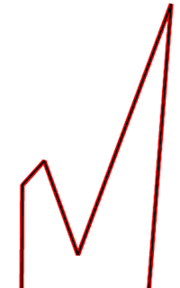

The simulated blend groups are generated with relatively simple linear interpolation routines which 
appear, for the given set of test cases, to approximate what !AWViewer is doing reasonably well.

When there is mismatch between the number of points there are routines that support the 
manual insertion of additional points into the target path (currently just for line segments).

With additional points placed in appropriate, but not necessarily correct, positions it seems that 
the simple linear interpolation approximates what !AWViewer is doing internally.

### Equal number of points

From the trivial cases examined this appears to work as one would expect. 
That is, the path is linearly interpolated.

Line segments paired with Béziers appear to be converted to Béziers with the control points
at a third and two-thirds of the way along the original line. Moving the control
points away from these offsets results in the simulated blend paths being visibly wrong.

!AWViewer appears to make some attempt to detect self-intersecting paths prior to blending. In the test
cases examined to date a self-intersecting Bézier segment is sufficient for the blending to deviate from the 
best case behaviour.

### Differing number of points

When the paths are not degenerate the approach appears to be to add more points to the path with the least
number of points so that the two paths can be linearly interpolated easily.

How !AWViewer decides to do this isn't really understood. 

We can however make the following observations (assuming the target has fewer points than the source)

1. The order of the points in the file is probably more important than the location of the points in space
2. There's probably a process that decides which points in the source path map onto those existing in the target
3. Once that mapping has been decided the source unmapped points are used to insert points into the target

Evidence for point (1) comes from experiments with a square being blended with a triangle. The square was rotated
at ten degree increments and at no time did !AWViewer choose to insert the required point on the triangle 
in a different location. It was always inserted at the midpoint of the second triangle edge.

(2) and (3) are demonstrated but not proven with a proposed methodology for (3) in the examples below.

#### Example 1

From one of the example files we take a source non-convex polygon with 8 points
and a target convex polygon with 5 points.

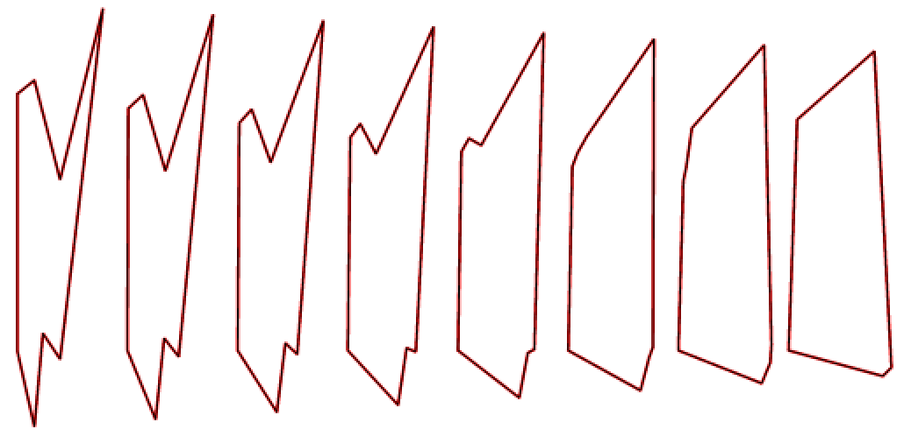

We label the points of the target polygon **A**, **B**, **C**, **D**, and **E**. It should be noted
that the points are defined in this clockwise order in the file. The target's points are also defined 
in a clockwise order.

How those points are mapped back onto the source polygon is shown in the figure below.


The source polygon's three additional points we label **X**, **Y** and **Z**.

At this time it is not understood how !AWViewer arrives at mapping.

In order to interpolate between the two polygons easily !AWViewer appears to insert three new points into the
target polygon at **X'**, **Y'** and **Z'** (their parametric distances along their respective
line segments are shown in the diagram).

Two options come to mind as to how !AWViewer decides to place **X'**, **Y'** and **Z'**.

1. Projection. For example by projecting the line segment **AX** onto the line between **AB**.
2. By using the lengths of the 'discarded' line segments to work out a parametric distances for the new points.

It's maybe reasonable to eliminate (1) since if projection were used then point **Z'** 
should be between **D** and **E** and not **C** and **D**.

Let `d(P, Q)` denote the distance between two points **P** and **Q**.

Therefore, parametric distance at which **X'** is inserted into the line segment **AB**, is

```text
X' = d(A, X) / (d(A, X) + d(X, Y) + d(Y, B))
```

Similarly, for **Y'**

```text
Y' = (d(A, X) + d(X, Y)) / (d(A, X) + d(X, Y) + d(Y, B))
```

and **Z'**

```text
Z' = d(C, Z) / (d(C, Z) + d(Z, D))
```

The values computed in this fashion agree broadly with what was estimated visually in !AWViewer
for this particular example.

#### Example 2

For a second example we take a minor variation on the first and replace the first line segment in the source
polygon with a cusp Bézier.

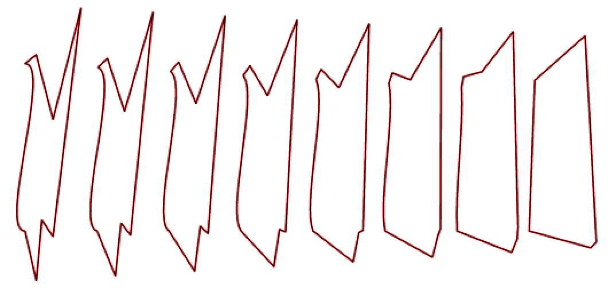

Sticking with the previous convention the mapping appears to be 

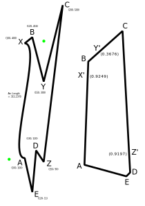

with the two green dots indicating the approximate positions of the cubic Bézier's control points.

The Bézier's arc length is 315.2378 (computed using [Pomax's Bézier JS][bezier-js]).

In order to work with Béziers we're going to have to modify the meaning of the `d` function in the previous
example. Let `d(P, Q)` mean the arc length of the segment defined by endpoints **P** and **Q**.

For straight line segments this definition of `d` retains is previous meaning.

Thus,

```text
X' = d(A, X) / (d(A, X) + d(X, B))
```

```text
Y' = d(B, Y) / (d(B, Y) + d(Y, C))
```

and

```text
Z' = d(C, Z) / (d(C, Z) + d(Z, D))
```

The major, perhaps key difference, between this result and the previous is that the line segment
**AB** only receives **one** additional point **X'**, with **Y'** being placed on the line
segment **BC**.

The point **Z'** remains in the same position in relation to the previous example.

#### Example 3

Motivated by the previous example and wishing to eliminate the introduction of a Bézier segment 
as the reason for the change in the inserted point distribution we replace the first cusp Bézier 
with a straight Bézier. Visually this identical to the first example.

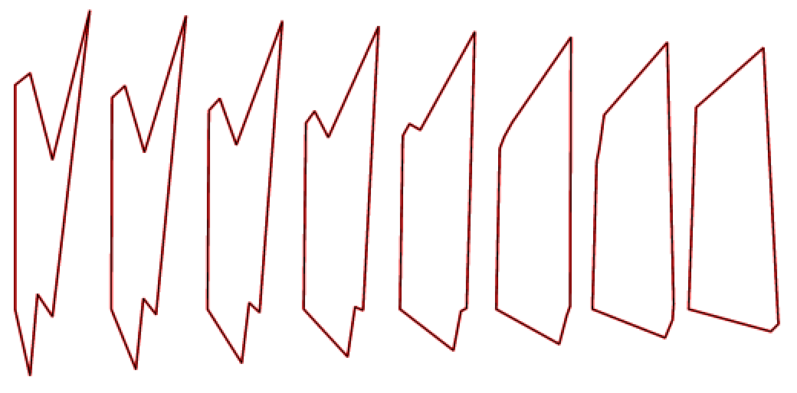

Therefore, with the green dots representing the control points as before,

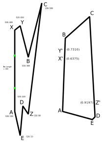

The point distribution is the same as the first example.

#### Example 4

We now ask ourselves the question of what happens for concave and convex Béziers as the first segment.

For symmetrical concave and convex Béziers with the control points evenly spaced vertically and both
control points the same distance from the vertical line defined by the start and end points of the first
segment the behaviour, up to a given distance from the aforementioned vertical line, the result is as follows,

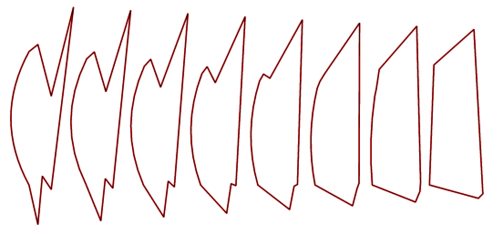
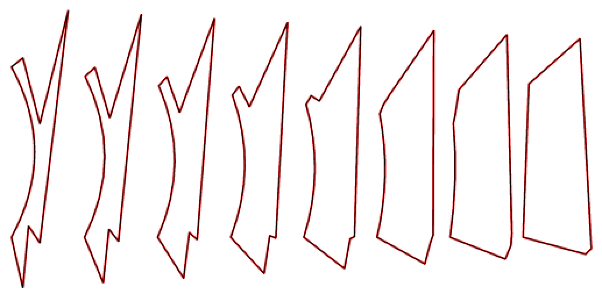

However, there appears to be a tipping point of one !AWViewer unit, beyond which the point distribution behaviour
changes. For both convex and concave cases, whose control points only differ by one horizontal unit from the above
(to the left and right respectively), the result is as follows.

The incorrect simulated blending is shown to help illustrate the problem.

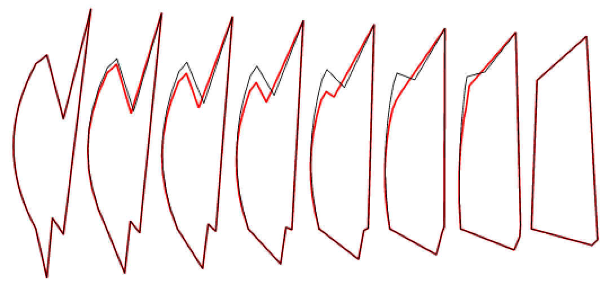
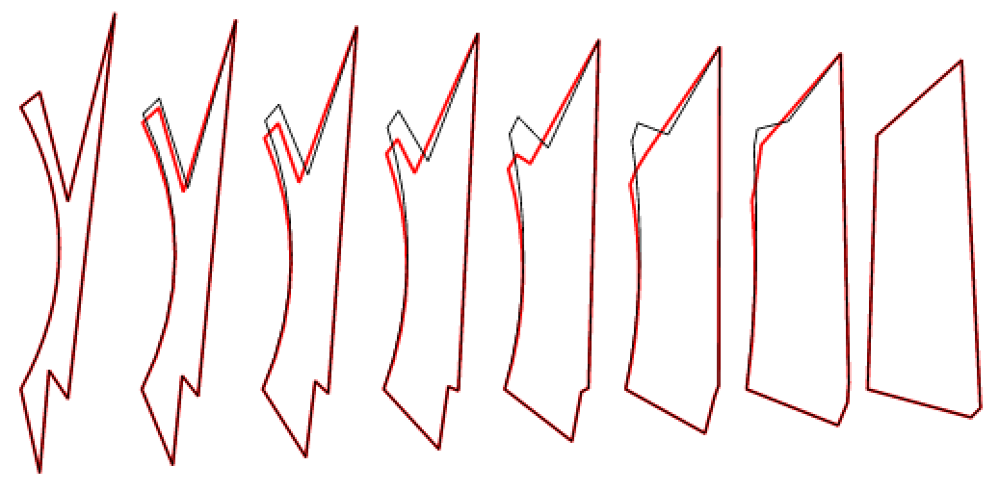

It is possible the arc length of the Bézier is influencing the result. However,
it seems that this may not be the case.

Consider the following diagram. 


The upper left path is the source path in the original point distribution regime and the lower left path
is the source path in the alternate point distribution regime.

Each point in each path is labelled with its parametric distance along its respective curve. We use parametric 
distances rather than absolute distances because we currently assume for the moment that the algorithm !AWViewer uses,
up to given tolerances, is independent of scale. In any case, the arc length of the first source segment is greater 
than the length of the first target segment.

The first thing to note that the parametric distances on the source paths have not changed significantly.
One would perhaps hope compared to the original regime point **Y**'s parametric distance might have advanced beyond
the parametric distance (0.3038) of point **B** on the target path, but is hasn't. This potentially rules out a
simple linear sweep assignment approach based on parametric distances.

Broadly, in the example given, a linear sweep might make a note of **B**'s target parametric distance and then loop
over the points in the source path. While the points in the source path have a parametric distance less than that
of **B** add those points to the first edge of the target path. Once the source parametric distance exceeds that
of **B** we then might then move to comparing against **C** and inserting points into the second target edge and so on.

This approach might work for the first two points in the original case it however fails in alternate case.

It's also worth noting at this point that both the convex and concave Bézier curves change the point distribution behaviour
when the arc length is greater than approximately 314.1592. However, the [cusp](#example-2) Bézier's point 
distribution behaviour changes when the arc length exceeds approximately 314.2051. Although it's possible !AWViewer's 
Bézier arc length calculation (if it has one) is approximate and the two values given here are within its tolerances 
for changing the regime it seems unlikely that !AWViewer uses arc lengths alone to determine the point distributions. 

#### Example 5

In the previous example we stated an unverified assumption that the blend groups work independently of scale.

In this example we observe what happens when we scale the target path. For a scale factor of 5% the result as follows

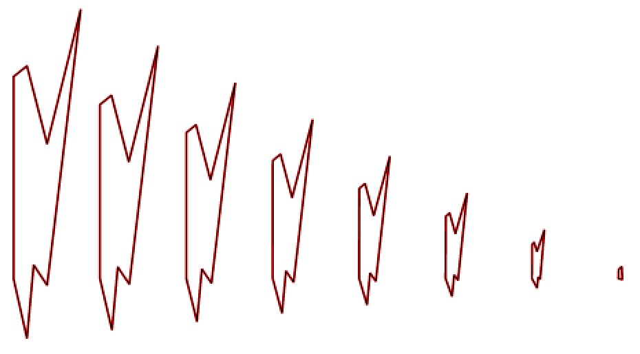

and the point distribution remains unchanged.

Scale factors up to 30 were tried and the result remained unchanged. What's perhaps more interesting
is when the target scale is set to zero

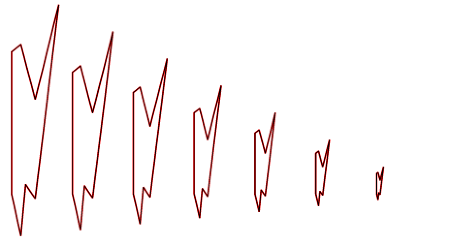

The distribution has remained unchanged. 

This implies that we can almost definitely exclude the parameter sweep idea since all the points
in this scaled target path are coincident and the path length is zero. This then makes parameterised
distances meaningless.

We can also infer that perhaps the only information that the algorithm uses from the target paths
is the number of edges/points. We can also potentially rule out other ideas like the point
distribution algorithm using other features of the target path (area, convexity) when making decisions.

#### Notes

The current thought is that !AWViewer uses some process other than relying on parametric distances and arc lengths
to determine how to distribute points on the target path.

Current idea: Given that there appears to be a step for testing self-intersection and compensatory steps
are taken if one is found it's possible that the algorithm uses area (since it's probably easier to compute
the area of a path if it's not degenerate). Perhaps, in the case of the examples above, it decides to remove
the three edges that change the area of the source path least.

Self-intersecting paths with a differing number of points hasn't been considered.

Target paths with Béziers and differing number of points hasn't been considered.

***

[bezier-js]: https://github.com/Pomax/bezierjs
